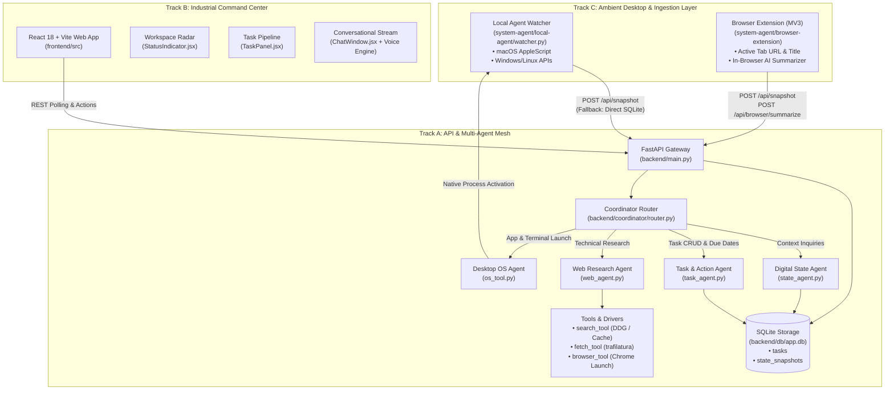
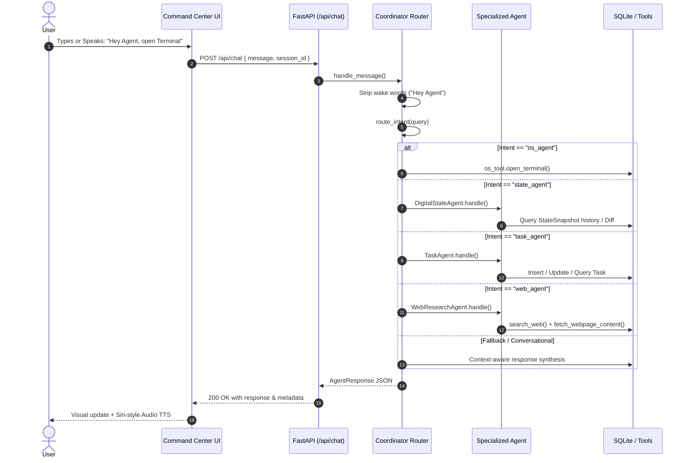
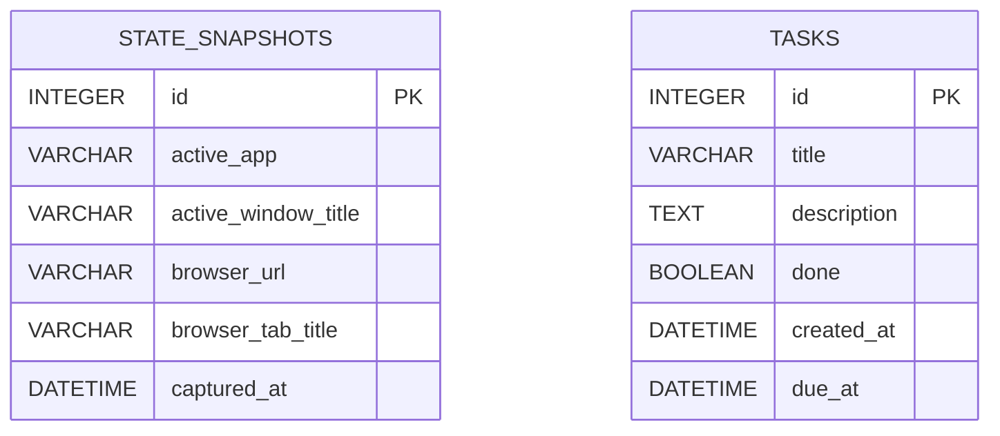

# Digital Workspace Agent — Comprehensive Technical Documentation

**Version:** 1.0.0  
**Repository:** `digital-workspace-agent`  
**Target Environment:** macOS (Darwin), Windows (Win32), Linux (POSIX)  
**Primary Stack:** Python 3.11+ (FastAPI, SQLAlchemy, Trafilatura) | React 18 + Vite (Vanilla CSS Tokens) | Chrome MV3 Extension  

---

## 1. Executive Summary & Product Vision

The **Digital Workspace Agent** is an ambient, local-first artificial intelligence assistant designed to operate alongside developers and knowledge workers. Unlike conventional chat interfaces that remain isolated in a web tab, the Digital Workspace Agent bridges the gap between active desktop execution and cognitive assistance. 

### Core Capabilities
1. **Ambient OS & Desktop Awareness (Track C)**: Continuously observes frontmost application states, window titles, and active browser URLs without logging keystrokes or infringing on privacy.
2. **Deterministic & LLM Multi-Agent Mesh (Track A)**: Orchestrates specialized sub-agents for state diffing, task extraction, web scraping, and native operating system command execution.
3. **Industrial Command Center UI (Track B)**: A React-based cyber-industrial interface providing live telemetry, task pipelines, speech synthesis (TTS), and hands-free voice command execution with wake-word detection.
4. **Resilient Offline Architecture**: Features multi-tier graceful fallbacks including instant cached search, regex intent extraction, and direct SQLite fallback writes when network services are unreachable.

---

## 2. High-Level Architecture & Track Breakdown

The project follows a decoupled, three-track architecture that ensures modularity, independent testing, and separation of concerns.



### Component Responsibility Matrix

| Track | Directory | Primary Role | Key Technologies |
|---|---|---|---|
| **Track A (AI/Backend)** | `backend/` | Central orchestration, REST API, multi-agent intent dispatch, database ORM. | FastAPI, Uvicorn, SQLAlchemy 2.0, Pydantic v2, Trafilatura |
| **Track B (Frontend)** | `frontend/` | Real-time command dashboard, radar telemetry, task board, Web Speech recognition & synthesis. | React 18, Vite, Lucide React, Marked, Web Audio API |
| **Track C (Systems)** | `system-agent/` | Native OS polling, window inspection, Chrome extension tab tracking. | Python (`osascript`, `psutil`), Chrome Extension Manifest V3 |
| **Shared** | `shared/` | Standardized JSON schema definitions for inter-service communication. | JSON Schema Draft 7 |

---

## 3. Detailed Component Specifications

### 3.1 Multi-Agent Coordination Mesh (`backend/coordinator/` & `backend/agents/`)

The multi-agent mesh is orchestrated by a central coordinator (`CoordinatorRouter`) that evaluates input prompts, handles conversational wake words, maintains in-memory session history, and routes tasks to specialized agents.



#### A. Coordinator Router (`backend/coordinator/router.py`)
- **Wake Word Detection**: Parses prefixes like `"Hey Agent"`, `"Hey Assistant"`, `"Agent,"`.
- **Intent Pattern Matching**: Leverages regex heuristics and keyword maps (`ROUTER_INTENT_PATTERNS`) for ultra-low latency routing (<5ms) before delegating to LLMs.
- **Context Preservation**: Employs `context_store.py` to retain recent conversation turns and browser tab metadata per session.

#### B. Digital State Agent (`backend/agents/state_agent.py`)
- **Query Resolution**: Resolves natural language inquiries such as:
  - *"What was I working on?"*
  - *"What changed while I was away?"*
  - *"What browser tabs did I have open?"*
- **State Diffing Algorithm**: Inspects adjacent snapshots in reverse chronological order:
  $$\Delta S = S_i \setminus S_{i+1}$$
  Detects application focus shifts, window title alterations, and browser URL transitions. Formats delta events with human-readable relative timestamps (`"2 minutes ago"`).

#### C. Task & Action Agent (`backend/agents/task_agent.py`)
- **Natural Language Parsing**: Identifies task creation intents (`"add task: ..."`, `"remind me to ..."`), task completions (`"mark task 2 as completed"`), and retrieval requests (`"show pending tasks"`).
- **Temporal Entity Extraction**: Converts relative expressions (`"tomorrow"`, `"tonight"`, `"in 2 days"`, `"by Friday"`) into ISO-8601 UTC datetimes via regex and `timedelta` offsets.

#### D. Web Research Agent (`backend/agents/web_agent.py`)
- **Search + Fetch + Synthesize Loop**:
  1. Identifies if the user requested a live desktop browser launch (`"search Railway vs Vercel on the browser"`).
  2. Launches Google Chrome directly on the host OS with the constructed search query.
  3. Programmatically queries DuckDuckGo or cached research payloads.
  4. Scrapes and parses top search hits using `trafilatura` to extract clean markdown text.
  5. Synthesizes a structured report with source citations and actionable recommendations.

#### E. Native OS & Tool Integration (`backend/tools/`)
- **`os_tool.py`**: Executes native process automation. On macOS, issues AppleScript via `osascript` to activate Terminal, VS Code, Finder, Calculator, Notes, Safari, or Chrome. Provides fallback process dispatchers for Windows (`cmd.exe`, `os.startfile`) and Linux (`x-terminal-emulator`, `xdg-open`).
- **`browser_tool.py`**: Cross-platform browser launcher supporting direct tab URL opening and URL parameter encoding.
- **`search_tool.py`**: Web search engine interface featuring instant offline caching (`MOCK_SEARCH_CACHE`) to guarantee zero-failure live demonstrations.
- **`fetch_tool.py`**: HTML content scraper that strips boilerplate, ads, scripts, and CSS, returning clean plain text.

---

### 3.2 Ambient State Ingestion Layer (`system-agent/`)

#### A. Local Agent Watcher (`system-agent/local-agent/watcher.py` & `snapshot.py`)
The local agent runs as a lightweight background daemon that continuously samples frontmost window states every 3 seconds (`POLL_INTERVAL`).

- **OS Window Inspection**:
  - **macOS**: Executes optimized AppleScript queries to `System Events` to obtain the frontmost process name, window title, and active tab URL for Chromium and Safari browsers.
  - **Windows Fallback**: Employs `ctypes` and `user32.dll` (`GetForegroundWindow`, `GetWindowTextW`) to extract active process handles and titles.
  - **Linux Fallback**: Employs `xdotool` and `_NET_ACTIVE_WINDOW` properties to capture X11 window descriptors.
- **State Deduplication**: Compares current window tuples `(active_app, active_window_title, browser_url)` against the previous snapshot. HTTP POST requests are only dispatched when state transitions occur.
- **Heartbeat Flush**: Dispatches a state refresh every 30 seconds (`FORCE_HEARTBEAT_INTERVAL`) even if no transition occurs, maintaining liveness.
- **Direct Database Fallback**: If the FastAPI backend is temporarily unavailable or starting up, the local agent writes directly to `app.db` via SQLAlchemy, ensuring zero data loss.

#### B. Browser Companion Extension (`system-agent/browser-extension/`)
Constructed as a Chrome Manifest V3 extension to provide high-precision tab tracking and in-browser intelligence.

- **Background Service Worker (`background.js`)**:
  - Subscribes to `chrome.tabs.onActivated` and `chrome.tabs.onUpdated`.
  - Debounces URL navigation events by 1,200ms to eliminate intermediate redirect noise.
  - Posts state payloads directly to `/api/snapshot`.
- **Content Script (`content.js`)**:
  - Injected on demand into active web pages.
  - Extracts clean article content, main headings, and metadata from the live DOM.
- **AI Page Summarization (`popup.js` / `/api/browser/summarize`)**:
  - Allows the user to trigger single-click page summaries from the extension popup.
  - Backend analyzes extracted text, determines topic categorization (e.g., API documentation, frontend architecture, pricing), highlights key takeaways, and suggests actionable tasks.

---

### 3.3 Command Center UI (`frontend/`)

The frontend is an industrial, low-latency dashboard built with React 18, Vite, and custom CSS design tokens.

#### Design System & Aesthetics
- **Color Palette**: Obsidian Slate (`#090B0D`), High-Frequency Cyber Lime (`#D4FF00`), Emerald Status Green (`#00F076`), Accent Titanium Blue (`#38BDF8`).
- **Typography**: System Monospace (`var(--font-mono)`) paired with high-legibility Sans-Serif (`Inter`, `-apple-system`).
- **Micro-Interactions**: Glassmorphic panels, glowing radar status rings, subtle pulse badges, and audio feedback chimes.

#### Key Sub-Modules
1. **Chat Window & Hands-Free Voice Engine (`ChatWindow.jsx`)**:
   - Integrated Web Speech API (`webkitSpeechRecognition`) supporting continuous listening.
   - Real-time wake phrase detection (`"Hey Agent"`, `"Agent,"`).
   - Siri-style rising acoustic tones generated on the fly via the Web Audio API (`OscillatorNode`).
   - Hands-free auto-execute timer with visual countdown chip.
2. **Text-To-Speech Audio Output (`MessageBubble.jsx` / `App.jsx`)**:
   - Synthesizes spoken agent responses using `window.speechSynthesis`.
   - Cleans markdown formatting, links, and code blocks prior to vocalization.
3. **Workspace Radar (`StatusIndicator.jsx`)**:
   - Renders the active application, window title, and active browser URL.
   - Provides a one-click trigger for analyzing recent context shifts.
4. **Task Pipeline Panel (`TaskPanel.jsx`)**:
   - Filterable view of action items (Active vs Completed).
   - Instant inline task creation and toggle completions.

---

## 4. Data Persistence & Schemas

### 4.1 SQLite Database Schema (`backend/db/models.py`)

The persistent layer uses SQLite via SQLAlchemy 2.0 with the following relational models:



#### Table: `state_snapshots`
| Column | Type | Constraints | Description |
|---|---|---|---|
| `id` | `INTEGER` | Primary Key, Auto-Increment | Unique snapshot identifier |
| `active_app` | `VARCHAR(255)` | Nullable | Frontmost application process name (e.g., `"Google Chrome"`, `"Visual Studio Code"`) |
| `active_window_title` | `VARCHAR(500)` | Nullable | Active window caption or document name |
| `browser_url` | `VARCHAR(1000)` | Nullable | Canonical web URL if active application is a supported browser |
| `browser_tab_title` | `VARCHAR(500)` | Nullable | Web page title tag |
| `captured_at` | `DATETIME` | Default: `utcnow`, Indexed | UTC timestamp of observation |

#### Table: `tasks`
| Column | Type | Constraints | Description |
|---|---|---|---|
| `id` | `INTEGER` | Primary Key, Auto-Increment | Unique task identifier |
| `title` | `VARCHAR(255)` | Not Null | Task title or summary |
| `description` | `TEXT` | Nullable | Detailed description or context note |
| `done` | `BOOLEAN` | Default: `False`, Not Null | Task completion status |
| `created_at` | `DATETIME` | Default: `utcnow`, Indexed | Creation timestamp |
| `due_at` | `DATETIME` | Nullable | Target due date and time |

---

## 5. REST API Specification

Base URL: `http://localhost:8000`

### 5.1 System & State Endpoints

#### `GET /health`
Verifies backend service liveness.
- **Response**: `200 OK`
```json
{
  "status": "ok",
  "timestamp": "2026-09-11T09:54:10.123456+00:00"
}
```

#### `POST /api/snapshot`
Ingests a workspace state snapshot from Track C (Local Agent or Browser Extension).
- **Request Body**:
```json
{
  "active_app": "Google Chrome",
  "active_window_title": "FastAPI Documentation — Overview",
  "browser_url": "https://fastapi.tiangolo.com/",
  "browser_tab_title": "FastAPI Documentation",
  "captured_at": "2026-09-11T09:50:00Z",
  "metadata": {
    "source": "local-agent",
    "os_platform": "darwin"
  }
}
```
- **Response**: `201 Created`
```json
{
  "status": "success",
  "snapshot": {
    "id": 42,
    "active_app": "Google Chrome",
    "active_window_title": "FastAPI Documentation — Overview",
    "browser_url": "https://fastapi.tiangolo.com/",
    "browser_tab_title": "FastAPI Documentation",
    "captured_at": "2026-09-11T09:50:00"
  }
}
```

#### `GET /api/snapshot/latest`
Returns the most recent snapshot captured in the database.
- **Response**: `200 OK` (or `null`)

#### `GET /api/snapshot/diff`
Computes state transitions across recent snapshots.
- **Query Parameters**:
  - `limit` (integer, optional, default: 5, range: 2-20)
- **Response**: `200 OK`
```json
{
  "summary": "Detected 2 workspace transition(s) recently.",
  "transitions": [
    {
      "timestamp": "2026-09-11T09:48:12",
      "time_ago": "2 minutes ago",
      "changes": [
        "Switched app from **Visual Studio Code** to **Google Chrome**",
        "Navigated browser to `https://fastapi.tiangolo.com/`"
      ]
    }
  ],
  "current": { ... }
}
```

---

### 5.2 Chat & Agent Coordinator Endpoints

#### `POST /api/chat`
Dispatches a user instruction to the coordinator mesh.
- **Request Body**:
```json
{
  "message": "Hey Agent, what was I working on?",
  "session_id": "default_session",
  "include_state": true
}
```
- **Response**: `200 OK`
```json
{
  "response": "You were actively working in **Google Chrome** on window: *\"FastAPI Documentation — Overview\"*.\nActive browser tab: [FastAPI Documentation](https://fastapi.tiangolo.com/)\nYour workspace context is synced and live.",
  "routed_agent": "state_agent",
  "tasks_created": [],
  "browser_info": null,
  "state_snapshot": { ... },
  "timestamp": "2026-09-11T09:50:05.123456+00:00"
}
```

---

### 5.3 Task Pipeline Endpoints

#### `GET /api/tasks`
Lists all workspace tasks, optionally filtered.
- **Query Parameters**:
  - `done` (boolean, optional): `true` or `false`
- **Response**: `200 OK` (Array of Task objects)

#### `POST /api/tasks`
Creates a new workspace task.
- **Request Body**:
```json
{
  "title": "Review deployment architecture",
  "description": "Evaluate Railway container configuration",
  "due_at": "2026-09-15T18:00:00Z"
}
```
- **Response**: `201 Created`

#### `PATCH /api/tasks/{task_id}`
Updates task attributes or toggles completion.
- **Request Body**:
```json
{
  "done": true
}
```
- **Response**: `200 OK`

---

### 5.4 Native Desktop & Browser Control Endpoints

#### `POST /api/browser/open`
Launches or brings the default desktop browser to the front with a specific URL.
- **Request Body**: `{"url": "https://fastapi.tiangolo.com"}`
- **Response**: `{"status": "success", "url": "https://fastapi.tiangolo.com"}`

#### `POST /api/browser/summarize`
Synthesizes webpage content scraped from the browser companion extension.
- **Request Body**:
```json
{
  "url": "https://docs.anthropic.com/",
  "title": "Anthropic API Documentation",
  "content": "Full page text extracted from DOM..."
}
```
- **Response**:
```json
{
  "success": true,
  "url": "https://docs.anthropic.com/",
  "title": "Anthropic API Documentation",
  "work_context": "API & SDK Documentation",
  "summary": "Actively reviewing model parameters and streaming protocols.",
  "key_takeaways": ["Requires bearer token authentication", "Supports streaming SSE"],
  "suggested_task": "Implement patterns from Anthropic API Doc",
  "timestamp": "2026-09-11T09:51:22+00:00"
}
```

#### `POST /api/os/terminal`
Launches native desktop Terminal window on macOS (`osascript`), Windows (`cmd.exe`), or Linux (`x-terminal-emulator`).
- **Response**: `{"success": true, "app": "Terminal"}`

#### `POST /api/os/app`
Launches any native desktop application.
- **Request Body**: `{"app_name": "Visual Studio Code"}`
- **Response**: `{"success": true, "app": "Visual Studio Code"}`

#### `POST /api/demo/seed`
Resets the SQLite database with rich baseline data for testing and demonstrations.
- **Response**: `{"status": "success", "message": "Demo data refreshed"}`

---

## 6. Environment & Configuration Reference

System configuration is managed via `.env` (configured via `.env.example` during setup).

| Variable Name | Default Value | Description |
|---|---|---|
| `BACKEND_HOST` | `0.0.0.0` | Host interface for FastAPI and Uvicorn |
| `BACKEND_PORT` | `8000` | Port for the backend API |
| `DATABASE_URL` | `sqlite:///./backend/db/app.db` | SQLAlchemy database connection URI |
| `AGENT_POLL_INTERVAL` | `3.0` | Interval (in seconds) between desktop window state checks |
| `AGENT_HEARTBEAT_INTERVAL` | `30.0` | Interval (in seconds) to force a state refresh to the backend |
| `BACKEND_API_URL` | `http://localhost:8000/api/snapshot` | Ingestion target endpoint for Track C local agent |
| `DIRECT_DB_FALLBACK` | `true` | When `true`, allows the local agent to write to SQLite if backend is down |
| `LOG_LEVEL` | `INFO` | Python logging verbosity (`DEBUG`, `INFO`, `WARNING`, `ERROR`) |
| `OPENAI_API_KEY` | *(Optional)* | Key for OpenAI GPT-4o-mini intent expansion and tab synthesis |
| `GROQ_API_KEY` | *(Optional)* | Key for Groq ultra-fast Llama-3 inference |
| `COORDINATOR_MODEL` | `gpt-4o-mini` | Default LLM model identifier when external API is configured |

---

## 7. Setup, Installation & Execution Guide

### 7.1 Prerequisites
- **Python**: 3.10, 3.11, or 3.12
- **Node.js**: 18.x or 20.x with `npm`
- **Operating System Permissions (macOS)**: Terminal and Python require Accessibility and Automation permissions under *System Settings > Privacy & Security* to query `System Events`.

### 7.2 Automated Setup (Recommended)
On macOS or Linux:
```bash
chmod +x scripts/setup.sh
./scripts/setup.sh
```

On Windows:
```cmd
scripts\setup.bat
```

The script automatically provisions a Python virtual environment (`.venv`), installs backend dependencies, initializes and seeds the SQLite database, and executes `npm install` for the frontend.

---

### 7.3 Manual Step-by-Step Execution

#### 1. Backend Server
```bash
source .venv/bin/activate
uvicorn backend.main:app --host 0.0.0.0 --port 8000 --reload
```
API Documentation and Swagger UI become available at `http://localhost:8000/docs`.

#### 2. Local State Watcher (Track C)
In a separate terminal window:
```bash
source .venv/bin/activate
python system-agent/local-agent/watcher.py
```

#### 3. Frontend Command Center (Track B)
In a separate terminal window:
```bash
cd frontend
npm run dev
```
Open `http://localhost:5173` in your browser.

#### 4. Browser Companion Extension (Track C)
1. Open Google Chrome, Brave, or Edge.
2. Navigate to `chrome://extensions/`.
3. Enable **Developer mode** (toggle in upper-right corner).
4. Click **Load unpacked** and select the directory:  
   `<PROJECT_ROOT>/system-agent/browser-extension`
5. The extension icon will appear in the toolbar. Click it to view connection status or perform manual tab sync.

---

### 7.4 Dockerized Deployment
To run the full stack containerized:
```bash
docker-compose up --build
```
- Backend is mapped to `http://localhost:8000`
- Frontend is mapped to `http://localhost:5173`

---

## 8. Directory & File Manifest

```
digital-workspace-agent/
├── .env.example                     # Environment configuration template
├── docker-compose.yml               # Container deployment specification
├── README.md                        # Project overview and entry point
├── TECHNICAL_DOCUMENTATION.md       # Comprehensive technical documentation (this file)
│
├── backend/                         # TRACK A: Backend & AI Mesh
│   ├── main.py                      # FastAPI application gateway & routing
│   ├── requirements.txt             # Python backend dependencies
│   ├── agents/                      # Specialized Domain Sub-Agents
│   │   ├── state_agent.py           # Digital State Agent (snapshot querying & diffing)
│   │   ├── task_agent.py            # Task & Action Agent (CRUD & natural language parsing)
│   │   └── web_agent.py             # Web Research Agent (search, scrape, synthesize)
│   ├── coordinator/                 # Coordinator Orchestrator
│   │   ├── router.py                # Intent classifier, wake-word detector, agent router
│   │   ├── context_store.py         # Multi-turn in-memory session manager
│   │   └── prompts.py               # Intent patterns & prompt templates
│   ├── db/                          # Database Layer
│   │   ├── db.py                    # SQLAlchemy engine and session context manager
│   │   ├── models.py                # StateSnapshot and Task ORM declarations
│   │   └── app.db                   # Local SQLite persistent database file
│   └── tools/                       # Tooling & Scraper Drivers
│       ├── browser_tool.py          # Native desktop browser launch utility
│       ├── fetch_tool.py            # Clean text extraction via Trafilatura
│       ├── os_tool.py               # Native OS application and terminal launcher
│       └── search_tool.py           # Web search engine interface with offline fallback
│
├── frontend/                        # TRACK B: Industrial Command Center
│   ├── index.html                   # HTML entry point
│   ├── package.json                 # Node dependencies and scripts
│   ├── vite.config.js               # Vite bundler configuration & proxy rules
│   └── src/
│       ├── main.jsx                 # React root bootstrap
│       ├── App.jsx                  # Master dashboard container, polling loop, TTS engine
│       ├── index.css                # Industrial cyber-token design system (Obsidian/Lime)
│       ├── api/
│       │   └── client.js            # Frontend REST API client
│       └── components/
│           ├── ChatWindow.jsx       # Chat stream, wake-phrase detector, Web Speech voice input
│           ├── MessageBubble.jsx    # Formatted markdown bubbles, agent tags, speech playback
│           ├── StatusIndicator.jsx  # Workspace Radar viewport & context transition trigger
│           └── TaskPanel.jsx        # Task pipeline board with filter toggles & inline add
│
├── system-agent/                    # TRACK C: Ambient OS & Browser State Ingestion
│   ├── README.md                    # System agent implementation guide
│   ├── local-agent/                 # Native OS Desktop Watcher
│   │   ├── config.py                # Polling and API configuration
│   │   ├── requirements.txt         # Local watcher dependencies (psutil, requests)
│   │   ├── snapshot.py              # OS-level active window & application inspector
│   │   └── watcher.py               # Continuous polling loop, deduplicator, fallback writer
│   └── browser-extension/           # Chrome Manifest V3 Extension Companion
│       ├── manifest.json            # MV3 permission & service worker declaration
│       ├── background.js            # Tab activation and navigation listener
│       ├── content.js               # DOM content extraction script
│       ├── popup.html               # Status and tab sync interface
│       └── popup.js                 # Popup logic and AI tab summarizer trigger
│
├── shared/                          # Inter-Track Shared Contracts
│   └── schemas/                     # JSON Schema Definitions (Draft-07)
│       ├── agent_request.json       # Chat request contract
│       ├── agent_response.json      # Chat response contract
│       └── state_snapshot.json      # State snapshot ingestion contract
│
├── docs/                            # Supplementary Documentation
│   ├── api-contracts.md             # REST endpoint details and payloads
│   ├── architecture.md              # Architectural overview and design diagrams
│   └── demo-script.md               # Presentation & live demonstration runbook
│
└── scripts/                         # Automation & Utility Scripts
    ├── seed_data.py                 # SQLite database seeder with baseline data
    ├── seed_demo_data.sh            # Unix shell wrapper for database seeding
    ├── seed_demo_data.bat           # Windows batch wrapper for database seeding
    ├── setup.sh                     # Unix all-in-one environment setup script
    └── setup.bat                    # Windows all-in-one environment setup script
```

---

## 9. Security, Privacy & Reliability Guarantees

1. **Local-First & Zero Keylogging**: The desktop watcher only inspects top-level window titles and application names exposed by the operating system window manager. It never captures keystrokes, clipboard buffers, or raw screen pixels.
2. **Deterministic Resiliency**: All core features (task management, state diffing, terminal launches, web research) operate deterministically with local heuristics and fallbacks, ensuring reliable operation even during network latency or API outages.
3. **Graceful Degraded States**:
   - If the FastAPI server is offline, the local agent writes state snapshots directly to SQLite.
   - If the live search API is unavailable, the web agent draws from pre-computed benchmark comparisons.
   - If speech recognition is unsupported by the browser, keyboard input and action chips remain accessible.
4. **Sandboxed Browser Operations**: The Chrome Extension utilizes restricted host permissions limited to `http://localhost:8000/*` and only accesses tab content upon user gesture or active navigation events.
