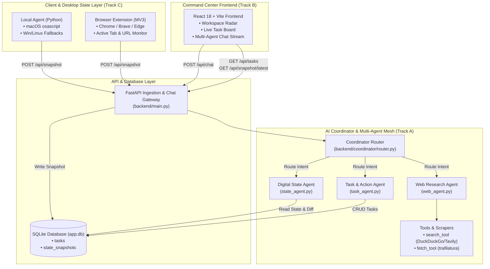

# Digital Workspace Agent — System Architecture

This document describes the end-to-end architecture, multi-agent coordination, and data flows of the **Digital Workspace Agent** system.

---

## 1. High-Level System Architecture

---

## 2. Component Responsibilities

### A. Coordinator & Routing Mesh (`backend/coordinator/`)
- **Intent Dispatcher**: Analyzes user prompts using intent patterns and LLM function calling to route to the appropriate domain agent.
- **Context Store**: In-memory session history and real-time state injection so the agent is always aware of the user's active application and window.
- **Failover Safe**: If external LLM or search APIs are unavailable during a live demo, the coordinator seamlessly uses local rule-based intent parsing and cached domain results.

### B. Specialized Agents (`backend/agents/`)
1. **Digital State Agent (`state_agent.py`)**:
   - Queries `StateSnapshot` table for active application and browser tab.
   - Answers *"What was I working on?"*
   - Performs state diffing across recent snapshots to report *"What changed while I was away?"*
2. **Task Agent (`task_agent.py`)**:
   - Natural language task extraction: parses action items, descriptions, and relative due dates ("by tomorrow 5pm").
   - Synchronizes directly with the SQLite database and pushes real-time updates to the UI.
3. **Web Research Agent (`web_agent.py`)**:
   - Executes search queries via DuckDuckGo / search APIs.
   - Uses `trafilatura` to extract clean article text from the top results.
   - Synthesizes findings into concise markdown summaries with citations.

### C. System Agent & Browser Extension (`system-agent/`)
- **Local Agent (`system-agent/local-agent/watcher.py`)**:
  - Background daemon that polls OS window titles every 3 seconds.
  - Detects state transitions to eliminate duplicate database writes.
  - Automatically posts snapshots to `POST /api/snapshot`.
- **Browser Companion (`system-agent/browser-extension/`)**:
  - Chrome Manifest V3 service worker that monitors active tabs and navigations.
  - Provides a status popup for connection health and manual synchronization.

### D. Industrial Command Center UI (`frontend/`)
- **Aesthetic**: Deep Obsidian Slate (`#090B0D`) paired with **Warm Amber Titanium (`#F59E0B`)** and **Emerald Green (`#10B981`)** status indicators. No generic purple/blue AI gradients.
- **Workspace Radar**: Real-time display of the frontmost window, active process, and current browser URL.
- **Action Items Board**: Interactive task checklist with filters (Active / Completed) and inline creation.
- **Agent Reasoning Stream**: Chat interface displaying routed agent badges (`[Digital State Agent]`, `[Web Research Agent]`, `[Task Agent]`) and instant prompt chips.

---

## 3. Data Schema & Persistence

### SQLite Tables (`backend/db/models.py`)
1. `tasks`:
   - `id`: Integer primary key
   - `title`: String(255)
   - `description`: Text
   - `done`: Boolean (default False)
   - `created_at`: DateTime
   - `due_at`: DateTime (optional)
2. `state_snapshots`:
   - `id`: Integer primary key
   - `active_app`: String(255)
   - `active_window_title`: String(500)
   - `browser_url`: String(1000)
   - `browser_tab_title`: String(500)
   - `captured_at`: DateTime
